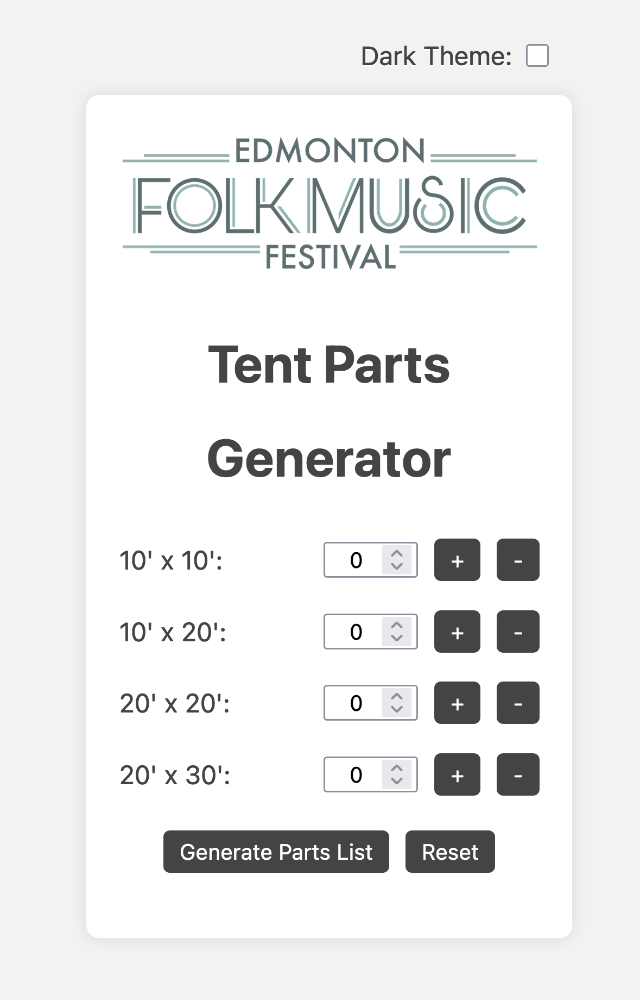
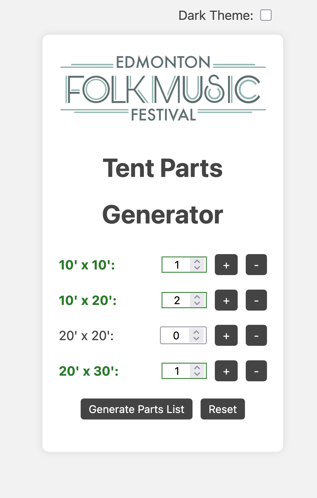
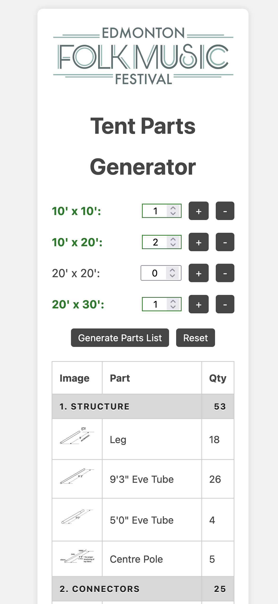

# Tent Parts Generator

A lightweight web app for generating tent assembly parts lists for the volunteers of the Site Production crew at the Edmonton Folk Music Festival.



## Features

- Generate parts lists for multiple tent sizes
- Supports:
  - 10' x 10'
  - 10' x 20'
  - 20' x 20'
  - 20' x 30'
- Parts organized by numbered category (Structure, Connectors, Hardware, Canopy) with per-category subtotals
- Increment/decrement controls for fast quantity entry
- Active tent highlighting — selected sizes are visually flagged before generating
- Dark mode toggle (with system preference detection and local storage persistence)
- Click-to-enlarge part images with descriptions
- Simple static frontend with no backend required
- Mobile-friendly responsive layout

## Purpose

This tool is designed to help Site Production tent building crews get accurate part counts when picking pieces up from the tent boneyards at the festival site.

## Usage

The site is meant to be easily hosted on a VPS and accessed by field users via browser on a smartphone.



1. Navigate to the site URL on your phone
2. Enter the number of each tent size needed using the `+` / `-` buttons
3. Tap **Generate Parts List** to see a full breakdown of required parts
4. Tap any part image to view a larger version with a description
5. Tap **Reset** to clear all inputs and start over



## Deployment

The app is fully static — just serve the project directory from any web server (e.g. Nginx or Apache). No build step or dependencies required.

## Project Structure

```
├── index.html          # Main HTML file
├── styles.css          # Styling and dark mode theming
├── script.js           # Parts catalog, tent BoMs, and app logic
├── screenshots/        # README screenshots
└── images/
    ├── efmf-logo.png
    ├── parts/          # Part thumbnail images
    └── tents/          # Tent thumbnail images
```

## Parts Data

Parts are defined in `script.js` as a flat catalog (single source of truth) and organized into four numbered categories:

| # | Category   | Contents |
|---|------------|----------|
| 1 | Structure  | Legs, eve tubes, centre poles |
| 2 | Connectors | Corner joints, tee connectors, straight joiners, cross joints |
| 3 | Hardware   | Ground stakes, D-clips, wall cables, cross cables, leg cables |
| 4 | Canopy     | Canopy for each tent size |

Each tent size holds only a bill of materials — a list of part references and quantities. All part metadata (name, image, description) lives in the catalog. Quantities are automatically scaled based on the number of tents entered.
